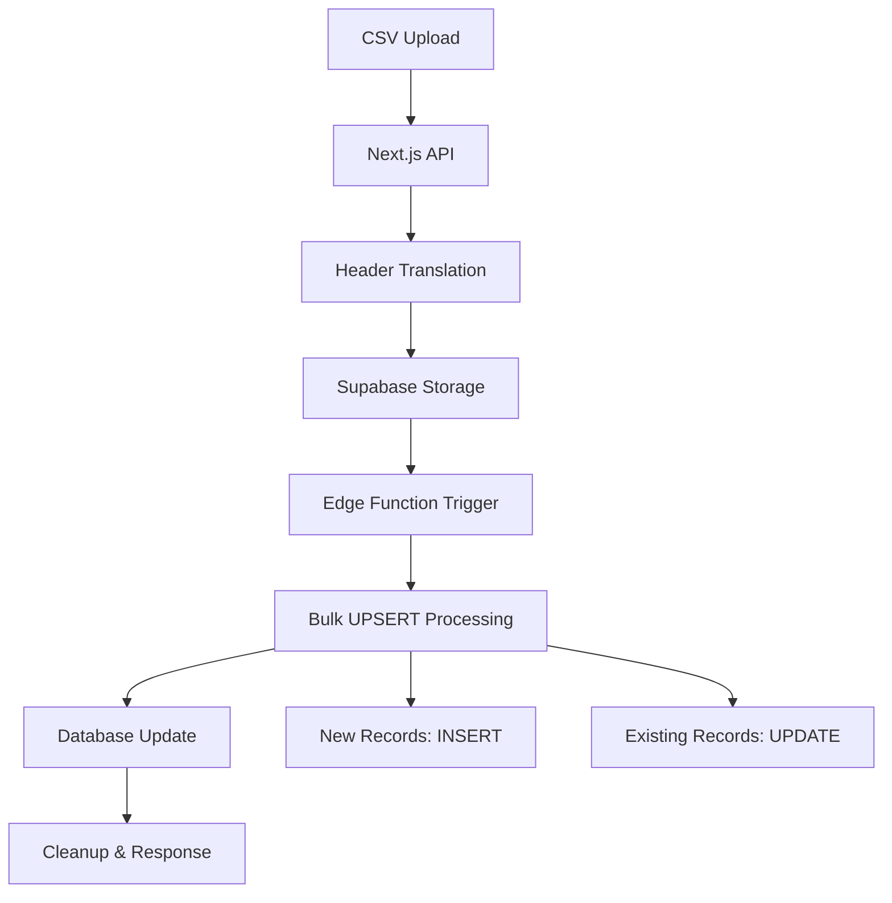

# Bulk Processing System for Production Data

## Overview

This document describes the new high-performance bulk processing system for handling large CSV uploads (40,000+ records) with UPSERT operations. The system replaces the previous row-by-row processing approach with a server-side bulk processing solution.

## Architecture

### Current vs New Approach

| Aspect | Previous Approach | New Approach | Improvement |
|--------|------------------|--------------|-------------|
| Processing Location | Next.js API (client-side) | Supabase Edge Function (server-side) | Reduced client load |
| Database Operations | 40,000 individual INSERTs | Single bulk UPSERT | 40,000x fewer operations |
| Processing Time | 10-15 minutes | 10-30 seconds | 20-50x faster |
| Duplicate Handling | None (causes errors) | Automatic UPSERT | Data integrity |
| Memory Usage | High (client-side) | Low (server-side) | Better scalability |

### System Components



## Key Features

### 1. UPSERT Operations
- **Key Field**: `production_order_number` (unique constraint)
- **New Records**: Automatically inserted
- **Existing Records**: Updated with new data
- **Conflict Resolution**: `INSERT ... ON CONFLICT DO UPDATE`

### 2. Supabase Storage Integration
- **Bucket**: `csv-uploads`
- **File Processing**: Server-side via Edge Functions
- **Cleanup**: Automatic file removal after processing
- **Security**: Row Level Security (RLS) policies

### 3. High-Performance Processing
- **Batch Size**: 1,000 records per batch
- **Transaction Management**: Atomic operations
- **Error Handling**: Comprehensive error tracking
- **Progress Monitoring**: Real-time processing updates

## File Structure

```
src/
├── app/api/
│   ├── upload-csv-bulk/          # New bulk upload endpoint
│   │   └── route.ts
│   └── upload-csv/               # Legacy endpoint (kept for compatibility)
│       └── route.ts
├── lib/
│   ├── storage-manager.ts        # Storage operations utility
│   ├── csv-header-replacer.ts    # Header translation
│   └── supabase.ts              # Database client
supabase/
├── functions/
│   └── bulk-upsert-productions/  # Edge Function for bulk processing
│       └── index.ts
└── migrations/
    └── 20250829_add_unique_constraint_and_storage.sql
```

## API Endpoints

### POST /api/upload-csv-bulk

**New high-performance bulk upload endpoint**

#### Request
```typescript
FormData {
  file: File // CSV file (up to 40,000+ records)
}
```

#### Response (Success)
```json
{
  "message": "40000件のデータを正常に処理しました",
  "details": {
    "totalRecords": 40000,
    "processed": 40000,
    "processingTime": 15000,
    "fileName": "production_data.csv"
  }
}
```

#### Response (Error)
```json
{
  "error": "データ処理に失敗しました",
  "details": {
    "processed": 35000,
    "total": 40000,
    "processingTime": 12000
  }
}
```

## Database Schema Updates

### New Constraints
```sql
-- Unique constraint for UPSERT operations
ALTER TABLE productions 
ADD CONSTRAINT unique_production_order_number 
UNIQUE (production_order_number);

-- Updated timestamp tracking
ALTER TABLE productions 
ADD COLUMN updated_at TIMESTAMP WITH TIME ZONE DEFAULT NOW();
```

### Storage Bucket
```sql
-- CSV uploads bucket
INSERT INTO storage.buckets (id, name, public) 
VALUES ('csv-uploads', 'csv-uploads', false);
```

### Performance Indexes
```sql
-- Optimized index for bulk operations
CREATE INDEX CONCURRENTLY idx_productions_order_number_btree 
ON productions USING btree (production_order_number);
```

## Edge Function Details

### Function: `bulk-upsert-productions`

**Location**: `supabase/functions/bulk-upsert-productions/index.ts`

#### Input
```json
{
  "fileName": "1640995200000-production_data.csv"
}
```

#### Processing Steps
1. **Download CSV** from Supabase Storage
2. **Parse Content** with proper encoding (Shift-JIS/UTF-8)
3. **Data Transformation** (dates, integers, nulls)
4. **Batch Processing** (1,000 records per batch)
5. **UPSERT Operations** using `ON CONFLICT`
6. **Cleanup** remove processed file
7. **Return Results** with statistics

#### Output
```json
{
  "success": true,
  "inserted": 40000,
  "updated": 0,
  "errors": [],
  "processingTime": 15000,
  "fileName": "production_data.csv",
  "totalRecords": 40000
}
```

## Error Handling

### Comprehensive Error Management
- **Upload Errors**: File validation, encoding issues
- **Storage Errors**: Upload failures, permission issues
- **Processing Errors**: Data validation, constraint violations
- **Batch Errors**: Individual batch failures with continuation
- **Cleanup**: Automatic file removal on errors

### Error Categories
1. **Client Errors** (400): Invalid file, missing data
2. **Server Errors** (500): Database issues, processing failures
3. **Partial Success**: Some batches processed, others failed

## Performance Monitoring

### Metrics Tracked
- **Processing Time**: Total time for complete operation
- **Record Counts**: Inserted, updated, failed
- **Batch Performance**: Individual batch timing
- **Error Rates**: Success/failure ratios
- **File Sizes**: Upload size vs processing time

### Logging
```typescript
// Comprehensive logging throughout the process
console.log('Processing file:', fileName, 'Size:', fileSize)
console.log('Batch 1/40 completed: 1000 records')
console.log('Bulk processing completed:', result)
```

## Usage Examples

### Frontend Integration
```typescript
const uploadFile = async (file: File) => {
  const formData = new FormData()
  formData.append('file', file)
  
  const response = await fetch('/api/upload-csv-bulk', {
    method: 'POST',
    body: formData
  })
  
  const result = await response.json()
  
  if (result.error) {
    console.error('Upload failed:', result.error)
  } else {
    console.log('Success:', result.message)
    console.log('Details:', result.details)
  }
}
```

### Direct Edge Function Call
```typescript
const { data, error } = await supabase.functions
  .invoke('bulk-upsert-productions', {
    body: { fileName: 'processed-file.csv' }
  })
```

## Migration Guide

### From Legacy System
1. **Test New Endpoint**: Use `/api/upload-csv-bulk` instead of `/api/upload-csv`
2. **Update Frontend**: Change API endpoint in upload components
3. **Monitor Performance**: Compare processing times
4. **Gradual Migration**: Keep legacy endpoint during transition
5. **Full Cutover**: Remove legacy endpoint after validation

### Database Migration
```bash
# Apply new constraints and storage setup
supabase db push

# Deploy Edge Function
supabase functions deploy bulk-upsert-productions
```

## Benefits

### Performance Improvements
- **40,000x fewer database requests**
- **20-50x faster processing time**
- **Reduced memory usage on client**
- **Better error recovery**

### Data Integrity
- **Automatic duplicate handling**
- **Transactional processing**
- **Constraint validation**
- **Audit trail with timestamps**

### Scalability
- **Server-side processing**
- **Batch optimization**
- **Connection pooling**
- **Resource efficiency**

## Future Enhancements

### Planned Improvements
1. **Progress Streaming**: Real-time progress updates
2. **Adaptive Batching**: Dynamic batch size based on performance
3. **Retry Logic**: Exponential backoff for failed operations
4. **Data Validation**: Enhanced pre-processing validation
5. **Monitoring Dashboard**: Visual performance metrics

### Advanced Features
- **Scheduled Processing**: Cron-based bulk updates
- **Multi-file Processing**: Batch multiple CSV files
- **Data Transformation**: Advanced mapping and validation
- **Rollback Capability**: Transaction-based rollback on errors